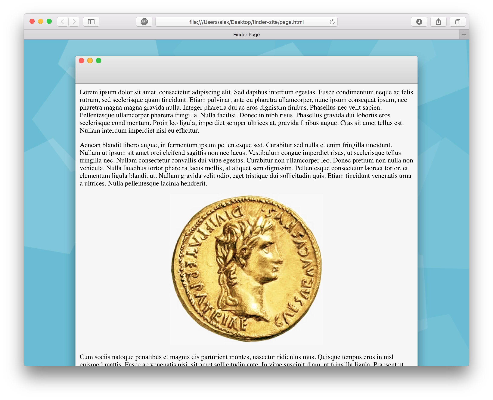

# What is it?

This is a small piece of code to make your websites look like they are inside an OS X Finder window. Here is what it looks like:

# TODO

If anybody actually decides to use this, there are a few things which you will probably want to do:

 * Improve performance on Firefox/Chrome
   * Make the middle part of the window a repeating background image.
   * Perhaps use a canvas for drawing the window.
 * Handle content size changes
   * Custom fonts might load asynchronously and change the content size.
   * Deal with users who have small browsers.
